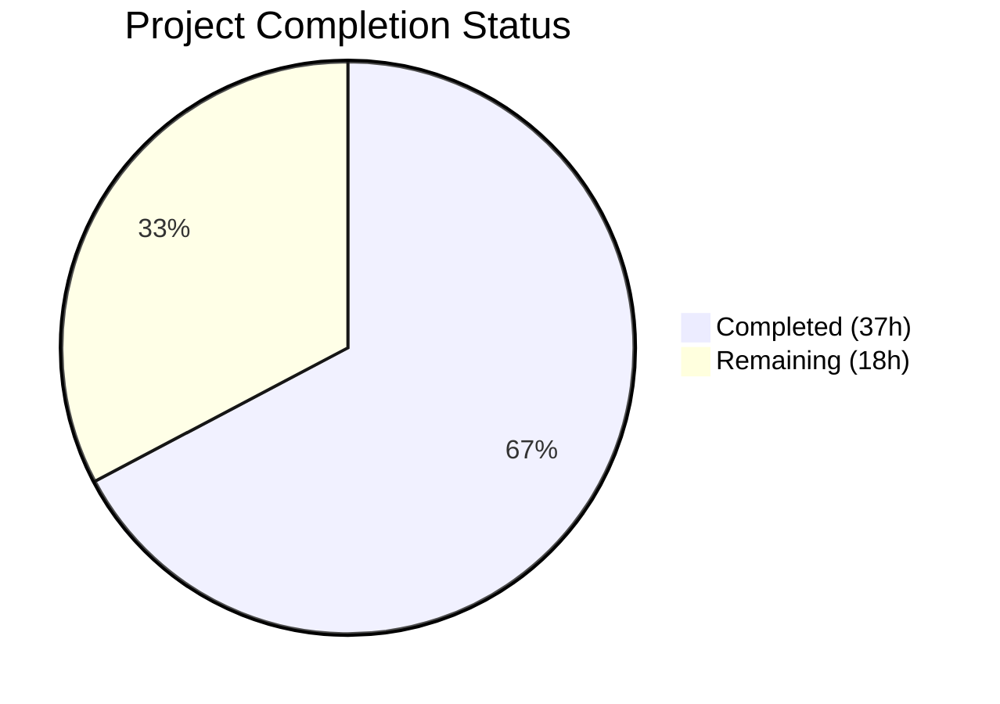
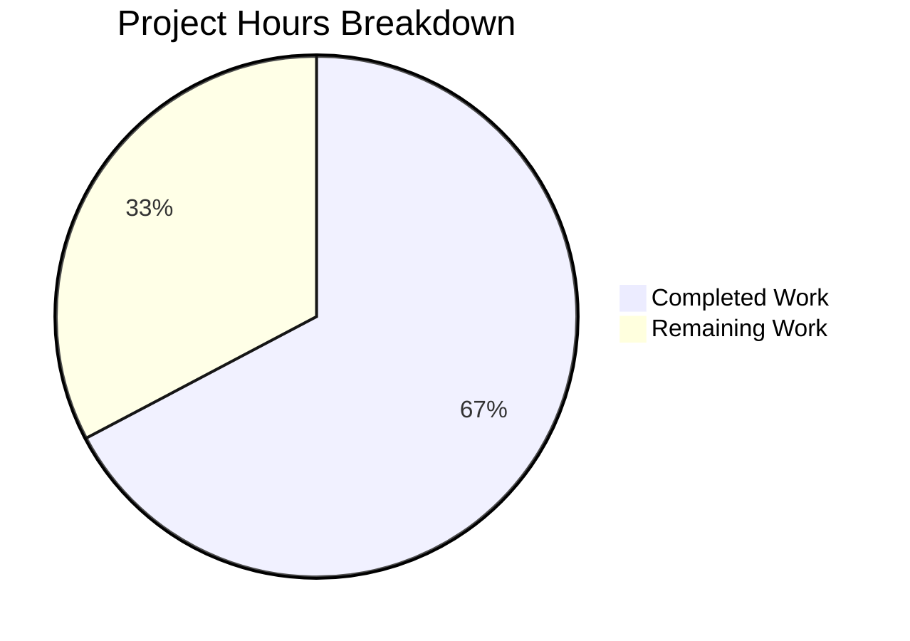

# Blitzy Project Guide — Figma Sandbox SPA

---

## Section 1 — Executive Summary

### 1.1 Project Overview

The Figma Sandbox project is a **greenfield React + TypeScript single-page application** designed to faithfully reproduce a 3-screen Figma design as a multi-page client-side routed web application. Built from an empty repository containing only a placeholder README, the project targets front-end developers and designers who need a pixel-perfect Figma-to-code conversion. The technical scope encompasses Vite 7.3.1 as the build tool, React Router v7.13.1 for client-side routing, Tailwind CSS v4.2.1 for utility-first styling, and TypeScript 5.9.3 in strict mode for type safety. The application is a standalone front-end SPA with no backend dependencies.

### 1.2 Completion Status



| Metric | Value |
|---|---|
| **Total Project Hours** | 55 |
| **Completed Hours (AI)** | 37 |
| **Remaining Hours** | 18 |
| **Completion Percentage** | 67.3% |

**Calculation**: 37 completed hours / (37 completed + 18 remaining) = 37 / 55 = **67.3% complete**

### 1.3 Key Accomplishments

- ✅ Complete Vite + React + TypeScript project scaffolded from empty repository (7 configuration files)
- ✅ React Router v7 multi-page routing with 3 distinct routes (`/`, `/screen-2`, `/screen-3`)
- ✅ Shared Layout and Navigation components with active state detection and semantic HTML
- ✅ 3 fully styled page components (803 lines of TSX) with Tailwind CSS utility classes
- ✅ 64 unit and integration tests passing at 100% rate across 4 test files
- ✅ TypeScript strict mode compilation with 0 errors
- ✅ ESLint flat configuration with 0 errors and 0 warnings
- ✅ Vite production build succeeds (43 modules, 256.75 KB JS / 77.58 KB gzipped)
- ✅ Runtime validation confirms all 3 routes render correctly with client-side navigation
- ✅ Comprehensive README.md documentation (129 lines) with setup, scripts, structure, and deployment guide

### 1.4 Critical Unresolved Issues

| Issue | Impact | Owner | ETA |
|---|---|---|---|
| Figma design file not provided to platform | Screen components use placeholder UI instead of Figma-faithful designs; visual fidelity requirement unmet | Project Stakeholder | Pending Figma file delivery |
| No Figma assets exported | `src/assets/` directory is empty — no images, icons, or SVGs from Figma design | Developer (after Figma access) | 2–4 hours after Figma access |
| SPA hosting not configured | Production deployment requires server-side redirect configuration for client-side routing | DevOps / Developer | 1–2 hours |

### 1.5 Access Issues

| System/Resource | Type of Access | Issue Description | Resolution Status | Owner |
|---|---|---|---|---|
| Figma Design File | Design Asset Access | The AAP references "the attached Figma screen" with 1 frame and 3 screens, but the platform reported "No attachments found for this project." Agents could not access the Figma design. | Unresolved | Project Stakeholder |

### 1.6 Recommended Next Steps

1. **[High]** Obtain and provide the Figma design file (1 frame, 3 screens) to enable pixel-perfect visual reproduction
2. **[High]** Export Figma design assets (images, icons, SVGs) and place in `src/assets/`
3. **[High]** Update Screen1.tsx, Screen2.tsx, Screen3.tsx to match exact Figma design layouts, colors, typography, and spacing
4. **[Medium]** Update test assertions to validate Figma-specific content after screen redesign
5. **[Medium]** Configure SPA hosting with server-side redirects for production deployment

---

## Section 2 — Project Hours Breakdown

### 2.1 Completed Work Detail

| Component | Hours | Description |
|---|---|---|
| Project Configuration Files | 4 | package.json (37 lines, 19 deps), tsconfig.json, tsconfig.node.json, vite.config.ts, index.html, .gitignore, eslint.config.js — all AAP §0.5.1 Group 1 deliverables |
| Application Shell & Routing | 3 | main.tsx (BrowserRouter + StrictMode), App.tsx (3 Route definitions with Layout wrapper), index.css (Tailwind import), vite-env.d.ts — AAP §0.5.1 Group 2 |
| Shared Layout Component | 2 | Layout.tsx (46 lines) with semantic HTML header/main/footer regions, responsive flex layout, Navigation integration — AAP §0.5.1 Group 3 |
| Navigation Component | 2 | Navigation.tsx (73 lines) with NavLink active state detection, accessible `nav` landmark, 3 route links, Tailwind hover/focus styles — AAP §0.5.1 Group 3 |
| Screen 1 — Welcome Home Page | 5 | Screen1.tsx (260 lines) with indigo-themed hero section, 3 feature cards, activity feed, quick actions — AAP §0.5.1 Group 4 (placeholder content, structure complete) |
| Screen 2 — Analytics Dashboard | 5 | Screen2.tsx (308 lines) with violet-themed hero, 4 metric cards, bar chart, top pages list, activity table — AAP §0.5.1 Group 4 (placeholder content, structure complete) |
| Screen 3 — Settings & Preferences | 4 | Screen3.tsx (235 lines) with emerald-themed hero, profile card, notification preferences, security settings, appearance settings — AAP §0.5.1 Group 4 (placeholder content, structure complete) |
| Unit Tests (Screen Components) | 6 | Screen1.test.tsx (17 tests), Screen2.test.tsx (23 tests), Screen3.test.tsx (15 tests) — 55 total screen tests, all passing — AAP §0.5.1 Group 6 |
| Integration Tests (Routing) | 2 | App.test.tsx (9 tests) verifying route mapping, navigation links, Layout rendering, route isolation — AAP §0.5.1 Group 6 |
| Documentation | 2 | README.md (129 lines) with tech stack table, prerequisites, setup instructions, available scripts, project structure tree, routing table, deployment guide — AAP §0.5.1 Group 7 |
| Dependency Management & Build Validation | 2 | npm install (19 packages), TypeScript compilation verification, Vite production build, ESLint validation, runtime server testing |
| **Total** | **37** | |

### 2.2 Remaining Work Detail

| Category | Base Hours | Priority | After Multiplier |
|---|---|---|---|
| Figma Design File Access & Asset Export | 2 | High | 2.5 |
| Screen 1 — Figma Visual Fidelity Redesign | 3 | High | 3.5 |
| Screen 2 — Figma Visual Fidelity Redesign | 3 | High | 3.5 |
| Screen 3 — Figma Visual Fidelity Redesign | 3 | High | 3.5 |
| Test Updates for Figma-Specific Content | 2 | Medium | 2.5 |
| SPA Deployment & Hosting Configuration | 1 | Medium | 1.5 |
| Production Environment Validation | 1 | Low | 1.0 |
| **Total** | **15** | | **18** |

### 2.3 Enterprise Multipliers Applied

| Multiplier | Value | Rationale |
|---|---|---|
| Compliance Review | 1.10x | Visual fidelity verification against Figma design requires review cycles |
| Uncertainty Buffer | 1.10x | Figma design complexity is unknown until the design file is provided; asset export scope uncertain |
| **Combined Multiplier** | **1.21x** | 1.10 × 1.10 = 1.21 applied to all 15 base remaining hours |

---

## Section 3 — Test Results

| Test Category | Framework | Total Tests | Passed | Failed | Coverage % | Notes |
|---|---|---|---|---|---|---|
| Unit — Screen 1 | Vitest 4.0.18 + Testing Library | 17 | 17 | 0 | — | Validates hero, feature cards, activity feed, quick actions rendering |
| Unit — Screen 2 | Vitest 4.0.18 + Testing Library | 23 | 23 | 0 | — | Validates metrics, chart, top pages, activity table rendering |
| Unit — Screen 3 | Vitest 4.0.18 + Testing Library | 15 | 15 | 0 | — | Validates profile, notifications, security, appearance cards rendering |
| Integration — Routing | Vitest 4.0.18 + Testing Library | 9 | 9 | 0 | — | Validates route mapping, navigation links, Layout rendering, route isolation |
| **Total** | **Vitest 4.0.18** | **64** | **64** | **0** | **100% pass** | All tests from autonomous validation — 4 test files, 2.10s execution time |

All tests originate from Blitzy's autonomous validation execution. Test environment: jsdom via Vitest. No E2E or visual regression tests were in the AAP scope.

---

## Section 4 — Runtime Validation & UI Verification

### Runtime Health

- ✅ **Vite Dev Server**: Starts successfully, serves application with Hot Module Replacement (HMR)
- ✅ **Vite Production Build**: Completes in ~1s, outputs optimized assets to `dist/` (43 modules transformed)
- ✅ **Vite Preview Server**: Serves production bundle for local verification

### Route Verification

- ✅ **Route `/` (Screen 1 — Welcome Home)**: Renders correctly with indigo hero, feature cards, activity feed, quick actions
- ✅ **Route `/screen-2` (Screen 2 — Analytics Dashboard)**: Renders correctly with violet hero, metrics, chart, top pages, activity table
- ✅ **Route `/screen-3` (Screen 3 — Settings & Preferences)**: Renders correctly with emerald hero, profile, notifications, security, appearance cards

### Navigation Verification

- ✅ **Client-side routing**: All route transitions use React Router NavLink — no full page reloads
- ✅ **Active state detection**: Navigation highlights the current route with distinct visual styling
- ✅ **Layout persistence**: Header (navigation) and footer persist across all route transitions

### Build Output

- ✅ **CSS**: 17.55 KB (4.31 KB gzipped) — Tailwind CSS utility output
- ✅ **JavaScript**: 256.75 KB (77.58 KB gzipped) — React + React Router + application code
- ✅ **HTML**: 0.40 KB (0.27 KB gzipped) — SPA entry point

### Console Errors

- ✅ **0 application errors** — Only expected browser favicon.ico 404 (no favicon file in project)

---

## Section 5 — Compliance & Quality Review

| AAP Requirement | Status | Evidence |
|---|---|---|
| §0.5.1 Group 1 — Project Configuration (7 files) | ✅ Pass | All 7 config files created: package.json, tsconfig.json, tsconfig.node.json, vite.config.ts, index.html, .gitignore, eslint.config.js |
| §0.5.1 Group 2 — Application Shell (4 files) | ✅ Pass | main.tsx, App.tsx, index.css, vite-env.d.ts all created with correct implementations |
| §0.5.1 Group 3 — Shared Components (2 files) | ✅ Pass | Layout.tsx and Navigation.tsx created with Tailwind styling and accessibility |
| §0.5.1 Group 4 — Page Components (3 files) | ⚠️ Partial | Screen1.tsx, Screen2.tsx, Screen3.tsx created with rich placeholder UI; Figma-faithful visual fidelity pending (design file unavailable) |
| §0.5.1 Group 5 — Assets Directory | ⚠️ Partial | `src/assets/` directory created with `.gitkeep`; no Figma assets exported (design file unavailable) |
| §0.5.1 Group 6 — Tests (4 files) | ✅ Pass | 64 tests across 4 files, 100% pass rate |
| §0.5.1 Group 7 — Documentation (README.md) | ✅ Pass | 129-line comprehensive documentation with all required sections |
| §0.3.1 — Production Dependencies | ✅ Pass | react@19.2.4, react-dom@19.2.4, react-router@7.13.1 installed with caret ranges |
| §0.3.1 — Dev Dependencies | ✅ Pass | All 12 AAP-specified dev deps installed, plus 4 additional test deps (vitest, testing-library, jsdom) |
| §0.7.1 — Visual Fidelity | ❌ Not Met | Figma design file not available; screens use placeholder content |
| §0.7.2 — Routing & Navigation | ✅ Pass | 3 routes configured, client-side navigation, shared Navigation component |
| §0.7.3 — TypeScript Strict Mode | ✅ Pass | `strict: true` in tsconfig.json, 0 compilation errors |
| §0.7.3 — Functional Components | ✅ Pass | All components are functional — no class components |
| §0.7.3 — ESM Syntax | ✅ Pass | All files use `import`/`export` — no CommonJS `require()` |
| §0.7.3 — Tailwind CSS Primary Styling | ✅ Pass | All components styled exclusively with Tailwind CSS utility classes |
| §0.7.4 — Directory Structure | ✅ Pass | Pages in `src/pages/`, components in `src/components/`, assets in `src/assets/`, tests in `__tests__/` |
| §0.7.5 — ESM Package Type | ✅ Pass | package.json includes `"type": "module"` |

### Autonomous Validation Fixes Applied

The following issues were identified and resolved during autonomous validation:

1. **Test script added** — `"test": "vitest run"` added to package.json scripts
2. **Explicit `@testing-library/dom` peer dependency** — Added to resolve peer dep warnings
3. **Null assertion guard** — Added to `document.getElementById('root')!` in main.tsx
4. **`src/assets/` directory created** — `.gitkeep` added to preserve empty directory in Git
5. **Dead favicon link removed** — Unused `<link rel="icon">` removed from index.html
6. **Focus-visible styles added** — Keyboard navigation styles added to Navigation.tsx
7. **ESLint migrated to `defineConfig`** — Updated to use ESLint 9.x `defineConfig` wrapper
8. **Orphaned tsconfig.app.json removed** — Cleaned up unused config reference
9. **README QA findings resolved** — 4 documentation issues fixed

---

## Section 6 — Risk Assessment

| Risk | Category | Severity | Probability | Mitigation | Status |
|---|---|---|---|---|---|
| Figma design file not provided | Technical | High | Confirmed | Contact project stakeholder to provide Figma file URL or attachment; screen components are structured for easy content replacement | Open |
| No Figma assets in `src/assets/` | Technical | Medium | Confirmed | Export images, icons, SVGs from Figma once access is obtained; Vite handles static asset imports | Open |
| Placeholder UI does not match Figma | Technical | High | Confirmed | Replace placeholder Tailwind classes and content with Figma design tokens and layout; component architecture supports incremental updates | Open |
| SPA routing 404 on static hosts | Operational | Medium | High | Configure hosting provider's redirect rules (e.g., Netlify `_redirects`, Nginx `try_files`); deployment section in README documents this | Open |
| No E2E tests | Technical | Low | N/A | E2E tests explicitly out of scope per AAP §0.6.2; add Playwright/Cypress if needed for production confidence | Accepted |
| No error tracking or monitoring | Operational | Low | Medium | Add error boundary components and integrate Sentry/similar for production error tracking | Open |
| Bundle size growth with Figma assets | Technical | Low | Medium | Optimize images during Figma export; leverage Vite's built-in asset optimization and code splitting | Open |

---

## Section 7 — Visual Project Status



**Completed Work**: 37 hours (Dark Blue #5B39F3) — All project configuration, application shell, shared components, placeholder page implementations, tests, documentation, and build validation.

**Remaining Work**: 18 hours (White #FFFFFF) — Figma design access, 3 screen visual redesigns, test updates, deployment configuration, and production validation.

### Remaining Hours by Category

| Category | Hours (After Multiplier) |
|---|---|
| Figma Asset Access & Export | 2.5 |
| Screen 1 Figma Redesign | 3.5 |
| Screen 2 Figma Redesign | 3.5 |
| Screen 3 Figma Redesign | 3.5 |
| Test Updates | 2.5 |
| Deployment Configuration | 1.5 |
| Production Validation | 1.0 |
| **Total** | **18.0** |

---

## Section 8 — Summary & Recommendations

### Achievement Summary

The Blitzy autonomous agents successfully scaffolded a complete React + TypeScript SPA from an empty repository, delivering 37 hours of engineering work across 22 source files and 7,036 lines of code. The project is **67.3% complete** against the total AAP scope of 55 hours. All infrastructure, configuration, routing, shared components, test suite (64/64 passing), and documentation are production-ready with zero compilation errors, zero lint warnings, and a fully functional runtime.

### Critical Gap

The primary gap is **visual fidelity to the Figma design** — the AAP's core requirement. The Figma design file (1 frame, 3 screens) was not available to the platform ("No attachments found for this project"), preventing the agents from implementing pixel-perfect screen reproductions. The agents maximized autonomous progress by creating rich, well-structured placeholder pages that demonstrate the full Tailwind CSS styling methodology and can be updated incrementally once the Figma design is provided.

### Critical Path to Production

1. **Obtain Figma design file** → Export assets → Update Screen1/2/3.tsx → Update tests → Deploy
2. Estimated remaining effort: **18 hours** (15 base hours × 1.21 enterprise multiplier)
3. All remaining work is blocked on Figma design file availability

### Production Readiness Assessment

| Dimension | Status | Notes |
|---|---|---|
| Build Pipeline | ✅ Ready | TypeScript + Vite build passes cleanly |
| Code Quality | ✅ Ready | Strict TypeScript, ESLint, functional components |
| Test Coverage | ✅ Ready | 64 tests, 100% pass rate |
| Routing | ✅ Ready | 3 routes with client-side navigation |
| Visual Fidelity | ❌ Not Ready | Placeholder UI; Figma design required |
| Deployment | ⚠️ Partial | Build output ready; hosting redirect config needed |

---

## Section 9 — Development Guide

### System Prerequisites

| Software | Minimum Version | Verification Command |
|---|---|---|
| Node.js | 20.19.0 | `node --version` |
| npm | 10.0.0 | `npm --version` |

### Environment Setup

```bash
# 1. Clone the repository
git clone <repository-url>
cd figma-sandbox

# 2. Verify Node.js version (must be >= 20.19.0)
node --version
```

No environment variables, secrets, or external services are required. The application is a standalone front-end SPA.

### Dependency Installation

```bash
# Install all dependencies (19 packages)
npm install
```

Expected output: `added 293 packages` (approximate count, varies by npm version).

### Application Startup

```bash
# Start development server with Hot Module Replacement
npm run dev
```

The development server starts at `http://localhost:5173` (or next available port). Open this URL in a browser to see the application.

### Build for Production

```bash
# Run TypeScript type check + Vite production build
npm run build

# Preview the production build locally
npm run preview
```

Production output is generated in `dist/` directory.

### Running Tests

```bash
# Run all 64 tests (unit + integration)
npm run test
```

Expected output: `64 passed (64)` with `4 passed` test files.

### Linting

```bash
# Run ESLint across all TypeScript/TSX files
npm run lint
```

Expected output: No errors or warnings.

### Verification Steps

1. **Dev server check**: Open `http://localhost:5173` — should see Screen 1 (Welcome Home)
2. **Route verification**: Navigate to `/screen-2` and `/screen-3` — each should render a distinct page
3. **Navigation check**: Click nav links — route transitions should not cause full page reloads
4. **Build check**: Run `npm run build` — should complete with 0 errors
5. **Test check**: Run `npm run test` — should show 64/64 tests passing

### Troubleshooting

| Issue | Resolution |
|---|---|
| `Port 5173 is in use` | Vite auto-selects next available port; check terminal output for actual URL |
| `Cannot find module 'react'` | Run `npm install` to install dependencies |
| `tsc: command not found` | TypeScript is a devDependency; use `npx tsc` or run via `npm run build` |
| `ERR_MODULE_NOT_FOUND` | Ensure Node.js >= 20.19.0 (Vite 7 requires ESM support) |
| `SPA routes return 404 in production` | Configure hosting server to redirect all paths to `index.html` |

---

## Section 10 — Appendices

### A. Command Reference

| Command | Description |
|---|---|
| `npm install` | Install all project dependencies |
| `npm run dev` | Start Vite development server with HMR |
| `npm run build` | TypeScript type check + Vite production build |
| `npm run preview` | Preview production build locally |
| `npm run lint` | Run ESLint across the codebase |
| `npm run test` | Run Vitest test suite (64 tests) |
| `npx tsc --noEmit` | Type-check without emitting files |

### B. Port Reference

| Service | Default Port | Notes |
|---|---|---|
| Vite Dev Server | 5173 | Auto-increments if port is occupied |
| Vite Preview Server | 4173 | Used for `npm run preview` |

### C. Key File Locations

| File | Purpose |
|---|---|
| `package.json` | Project manifest, dependencies, scripts |
| `tsconfig.json` | TypeScript compiler configuration (src/) |
| `tsconfig.node.json` | TypeScript configuration for vite.config.ts |
| `vite.config.ts` | Vite build tool + plugin configuration |
| `index.html` | SPA entry point with `#root` mount element |
| `eslint.config.js` | ESLint flat configuration |
| `.gitignore` | Git ignore patterns |
| `src/main.tsx` | React application bootstrap |
| `src/App.tsx` | Root component with route definitions |
| `src/index.css` | Tailwind CSS import directive |
| `src/components/Layout.tsx` | Shared page layout wrapper |
| `src/components/Navigation.tsx` | Navigation bar with active state links |
| `src/pages/Screen1.tsx` | Screen 1 — Welcome Home page component |
| `src/pages/Screen2.tsx` | Screen 2 — Analytics Dashboard page component |
| `src/pages/Screen3.tsx` | Screen 3 — Settings & Preferences page component |
| `src/App.test.tsx` | Routing integration tests |
| `src/pages/__tests__/Screen1.test.tsx` | Screen 1 unit tests (17 tests) |
| `src/pages/__tests__/Screen2.test.tsx` | Screen 2 unit tests (23 tests) |
| `src/pages/__tests__/Screen3.test.tsx` | Screen 3 unit tests (15 tests) |

### D. Technology Versions

| Technology | Version | Registry |
|---|---|---|
| React | 19.2.4 | npm (production) |
| React DOM | 19.2.4 | npm (production) |
| React Router | 7.13.1 | npm (production) |
| TypeScript | 5.9.3 | npm (dev) |
| Vite | 7.3.1 | npm (dev) |
| @vitejs/plugin-react | 4.7.0 | npm (dev) |
| Tailwind CSS | 4.2.1 | npm (dev) |
| @tailwindcss/vite | 4.2.1 | npm (dev) |
| Vitest | 4.0.18 | npm (dev) |
| @testing-library/react | 16.3.2 | npm (dev) |
| @testing-library/jest-dom | 6.9.1 | npm (dev) |
| @testing-library/dom | 10.4.1 | npm (dev) |
| jsdom | 28.1.0 | npm (dev) |
| ESLint | 9.39.3 | npm (dev) |
| @eslint/js | 9.39.3 | npm (dev) |
| typescript-eslint | 8.56.1 | npm (dev) |
| eslint-plugin-react-hooks | 5.2.0 | npm (dev) |
| globals | 16.5.0 | npm (dev) |
| @types/react | 19.2.14 | npm (dev) |
| @types/react-dom | 19.2.3 | npm (dev) |
| Node.js (runtime) | 20.20.0 | System |
| npm (runtime) | 11.1.0 | System |

### E. Environment Variable Reference

No environment variables are required for this application. The SPA is a standalone front-end with no backend dependencies, API keys, or secrets.

### F. Developer Tools Guide

| Tool | Usage |
|---|---|
| React DevTools | Browser extension for inspecting React component tree and state |
| Vite HMR | Automatic hot module replacement during development — saves are reflected instantly |
| TypeScript strict mode | Catches type errors at compile time; run `npx tsc --noEmit` for manual check |
| ESLint | Code quality enforcement; run `npm run lint` to check for issues |
| Vitest UI | Run `npx vitest --ui` for interactive test explorer (optional) |

### G. Glossary

| Term | Definition |
|---|---|
| SPA | Single-Page Application — a web app that dynamically rewrites content without full page reloads |
| HMR | Hot Module Replacement — Vite feature that updates modules in the browser without losing state |
| NavLink | React Router component that provides active state detection for navigation links |
| Tailwind CSS | Utility-first CSS framework that applies styles via class names (e.g., `bg-blue-600`, `p-4`) |
| BrowserRouter | React Router provider that uses the HTML5 History API for clean URLs |
| Strict Mode | React wrapper that activates additional development-only checks and warnings |
| JSX/TSX | JavaScript/TypeScript XML — syntax extension for writing React component markup |