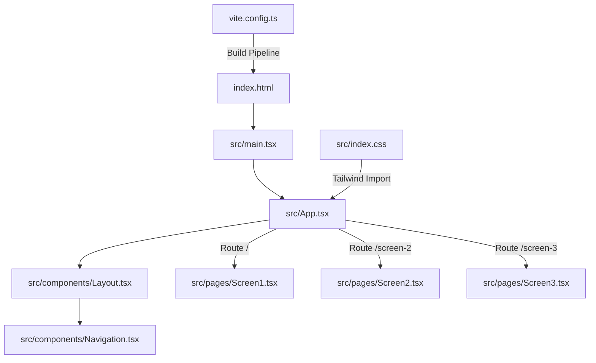

# Technical Specification

# 0. Agent Action Plan

## 0.1 Intent Clarification

### 0.1.1 Core Feature Objective

Based on the prompt, the Blitzy platform understands that the new feature requirement is to **convert a Figma design into a fully functional front-end application** within the `figma-sandbox` repository. Specifically:

- **Figma-to-Code Conversion**: The user requires front-end code that faithfully reproduces the visual design specified in an attached Figma file containing **1 frame and 3 screens**
- **Multi-Page Routing Architecture**: Each of the 3 screens must be implemented as a **separate page/route** in the front-end application, establishing a multi-page single-page application (SPA) with client-side routing
- **Pixel-Perfect Visual Fidelity**: The user explicitly states screens should be built "exactly as in the screens," indicating a strict visual fidelity requirement to the Figma design
- **Greenfield Project**: The repository currently contains only a `README.md` file with the heading `# figma-sandbox`, meaning the entire front-end application must be created from scratch — including project scaffolding, dependency installation, routing configuration, and all component code

**Critical Constraint — Figma Attachments Not Available**: The system reports "No attachments found for this project." The user references "the attached Figma screen," but no Figma file URLs or image attachments were provided to the Blitzy platform. This means the implementation agents will need to rely on any Figma assets that become available through the platform's Figma MCP integration or proceed with the project scaffolding and structural setup pending design input.

### 0.1.2 Special Instructions and Constraints

- **Exact Visual Reproduction**: The user's directive to build screens "exactly as in the screens" establishes a zero-deviation visual fidelity requirement — all spacing, colors, typography, layout, and component structure must match the Figma source
- **Route-Per-Screen Architecture**: Each of the 3 Figma screens maps to a dedicated route — this implies a React Router (or equivalent) configuration with 3 distinct page components
- **No Technology Stack Specified**: The user did not prescribe a specific front-end framework, CSS methodology, or build tooling. The Blitzy platform will select a modern, industry-standard technology stack appropriate for a greenfield SPA with routing
- **No Backend Requirements**: The user's request is exclusively front-end — there is no mention of API integration, database connectivity, authentication, or server-side rendering requirements
- **No Setup Instructions Provided**: No environment setup instructions, environment variables, or secrets were attached to the project

### 0.1.3 Technical Interpretation

These feature requirements translate to the following technical implementation strategy:

- To **scaffold the application**, we will create a new React + TypeScript project using Vite as the build tool, establishing the foundational project structure with all necessary configuration files
- To **implement multi-page routing**, we will integrate React Router v7 with a `BrowserRouter` configuration defining 3 routes — one for each Figma screen — with a root layout component providing shared navigation structure
- To **achieve visual fidelity**, we will use Tailwind CSS v4 as the utility-first styling framework, enabling rapid and precise translation of Figma design tokens (colors, spacing, typography, borders, shadows) into CSS classes applied directly to React components
- To **structure the codebase**, we will organize components into a feature-based directory structure with shared/common components separated from page-specific components, following React community conventions
- To **ensure production readiness**, we will configure TypeScript strict mode, ESLint for code quality, and Vite's optimized production build pipeline

## 0.2 Repository Scope Discovery

### 0.2.1 Comprehensive File Analysis

The `figma-sandbox` repository is a **completely empty greenfield project**. Inspection of the repository root at `/tmp/blitzy/figma-sandbox/main_0d6e40/` confirms only two items exist:

| Current Path | Type | Content |
|---|---|---|
| `.git/` | Directory | Git version control metadata |
| `README.md` | File | Single line: `# figma-sandbox` |

There are **zero existing source files, zero configuration files, zero dependency manifests, and zero test files** to modify. Every file required for the front-end application must be **created from scratch**.

**Integration Point Discovery**: Since this is a greenfield project with no backend, there are no existing API endpoints, database models, service classes, controllers, or middleware to integrate with. The application is a standalone front-end SPA.

### 0.2.2 New File Requirements

The following complete file tree must be created to establish the front-end application:

**Project Root Configuration Files:**

| File to Create | Purpose |
|---|---|
| `package.json` | Node.js project manifest with all dependencies, scripts, and metadata |
| `tsconfig.json` | TypeScript compiler configuration with strict mode and React JSX support |
| `tsconfig.node.json` | TypeScript configuration for Vite's Node.js context |
| `vite.config.ts` | Vite build tool configuration with React plugin and Tailwind CSS integration |
| `index.html` | SPA entry point HTML file with root mount element |
| `.gitignore` | Git ignore rules for `node_modules/`, `dist/`, and build artifacts |
| `eslint.config.js` | ESLint flat configuration for TypeScript + React linting rules |

**Source Files — Application Shell:**

| File to Create | Purpose |
|---|---|
| `src/main.tsx` | Application entry point — renders React root with Router provider |
| `src/App.tsx` | Root application component with React Router route definitions |
| `src/App.css` | Global application-level styles (if needed beyond Tailwind) |
| `src/index.css` | Tailwind CSS import directive and global CSS resets |
| `src/vite-env.d.ts` | Vite client type declarations for TypeScript |

**Source Files — Page Components (3 routes):**

| File to Create | Purpose |
|---|---|
| `src/pages/Screen1.tsx` | Page component for Figma Screen 1 — mapped to Route 1 |
| `src/pages/Screen2.tsx` | Page component for Figma Screen 2 — mapped to Route 2 |
| `src/pages/Screen3.tsx` | Page component for Figma Screen 3 — mapped to Route 3 |

**Source Files — Shared Components:**

| File to Create | Purpose |
|---|---|
| `src/components/Layout.tsx` | Shared layout wrapper providing consistent page structure and navigation |
| `src/components/Navigation.tsx` | Navigation bar/menu component linking between the 3 screen routes |

**Source Files — Assets:**

| File to Create | Purpose |
|---|---|
| `src/assets/` | Directory for static assets (images, icons, fonts) extracted from Figma |

**Test Files:**

| File to Create | Purpose |
|---|---|
| `src/pages/__tests__/Screen1.test.tsx` | Unit tests for Screen 1 component rendering and content |
| `src/pages/__tests__/Screen2.test.tsx` | Unit tests for Screen 2 component rendering and content |
| `src/pages/__tests__/Screen3.test.tsx` | Unit tests for Screen 3 component rendering and content |
| `src/App.test.tsx` | Integration test for routing configuration and navigation |

**Documentation:**

| File to Create | Purpose |
|---|---|
| `README.md` | Updated project documentation with setup instructions, tech stack, and usage guide |

### 0.2.3 Web Search Research Conducted

The following research was conducted to validate technology choices and identify current stable versions:

- **React latest stable version** — Confirmed React 19.2.4 as the latest stable release on npm, with React 19 introducing Server Components, the `use` hook, and the `Activity` component
- **Vite latest stable version** — Confirmed Vite 7.3.1 as the latest stable release, requiring Node.js 20.19+ or 22.12+, now distributed as ESM-only with Baseline Widely Available browser targeting
- **React Router latest stable version** — Confirmed React Router 7.13.1 as the latest stable release, with stabilized middleware and context APIs, improved TypeScript support, and unified `react-router` package (replacing `react-router-dom`)
- **Tailwind CSS latest stable version** — Confirmed Tailwind CSS 4.2.1 as the latest stable release, featuring a CSS-first configuration approach with `@theme` directive, first-party Vite plugin (`@tailwindcss/vite`), and automatic content detection
- **TypeScript latest stable version** — Confirmed TypeScript 5.9.3 as the latest stable release (TypeScript 6.0 is in beta as a bridge to the Go-based TypeScript 7.0)

## 0.3 Dependency Inventory

### 0.3.1 Private and Public Packages

Since the repository is entirely empty with no existing `package.json`, all dependencies must be freshly installed. The following packages are selected based on the user's requirements (3-screen SPA with routing) and current stable ecosystem versions:

**Production Dependencies:**

| Registry | Package Name | Version | Purpose |
|---|---|---|---|
| npm | `react` | ^19.2.4 | Core React UI library for building component-based interfaces |
| npm | `react-dom` | ^19.2.4 | React DOM renderer for web browser environments |
| npm | `react-router` | ^7.13.1 | Client-side routing library for multi-page SPA navigation between 3 screens |

**Development Dependencies:**

| Registry | Package Name | Version | Purpose |
|---|---|---|---|
| npm | `typescript` | ^5.9.3 | TypeScript compiler for static type checking and JSX transformation |
| npm | `vite` | ^7.3.1 | Next-generation frontend build tool for development server and production builds |
| npm | `@vitejs/plugin-react` | ^4.5.2 | Official Vite plugin for React Fast Refresh and JSX support |
| npm | `tailwindcss` | ^4.2.1 | Utility-first CSS framework for rapid, design-faithful styling |
| npm | `@tailwindcss/vite` | ^4.2.1 | First-party Tailwind CSS Vite plugin for optimized integration |
| npm | `@types/react` | ^19.2.0 | TypeScript type definitions for React |
| npm | `@types/react-dom` | ^19.2.0 | TypeScript type definitions for React DOM |
| npm | `eslint` | ^9.28.0 | JavaScript/TypeScript linter for code quality enforcement |
| npm | `@eslint/js` | ^9.28.0 | ESLint's core JavaScript rule set for flat config |
| npm | `typescript-eslint` | ^8.33.0 | TypeScript parser and plugin for ESLint |
| npm | `eslint-plugin-react-hooks` | ^5.2.0 | ESLint plugin enforcing React Hooks rules |
| npm | `globals` | ^16.2.0 | Global variable definitions for ESLint environment configuration |

**Runtime Requirements:**

| Runtime | Version | Rationale |
|---|---|---|
| Node.js | >=20.19.0 | Required by Vite 7.x for ESM-only distribution and `require(esm)` support |
| npm | >=10.0.0 | Package manager for dependency installation and script execution |

### 0.3.2 Dependency Updates

Since this is a greenfield project with no existing dependencies, there are no import transformations, migration steps, or external reference updates required. All dependencies will be installed fresh via `npm install`.

**Import Convention for New Code:**

All new source files will follow these import patterns:

- React imports: `import { useState, useEffect } from 'react'`
- React Router imports: `import { BrowserRouter, Routes, Route, Link } from 'react-router'`
- Component imports: Relative paths using TypeScript path resolution (e.g., `import { Layout } from '../components/Layout'`)

**Build Configuration:**

- `package.json` scripts will include: `dev` (Vite dev server), `build` (TypeScript check + Vite production build), `preview` (Vite production preview), and `lint` (ESLint)
- No CI/CD pipeline files are in scope — the user requested only front-end code generation

## 0.4 Integration Analysis

### 0.4.1 Existing Code Touchpoints

Since the `figma-sandbox` repository is an empty greenfield project, there are **no existing code touchpoints** to modify. The sole existing file — `README.md` — will be replaced with comprehensive project documentation.

| Existing File | Modification Required |
|---|---|
| `README.md` | **REPLACE** — Overwrite the single-line placeholder with full project documentation including tech stack, setup instructions, available scripts, and project structure overview |

### 0.4.2 Internal Integration Points

The front-end application will establish the following internal integration points between newly created modules:

**Routing Integration:**

- `src/main.tsx` → `src/App.tsx`: The entry point renders the `App` component which owns the router configuration
- `src/App.tsx` → `src/pages/Screen1.tsx`, `src/pages/Screen2.tsx`, `src/pages/Screen3.tsx`: The router maps URL paths to the 3 page components
- `src/components/Navigation.tsx` → React Router `Link` components: Navigation links trigger client-side route transitions

**Layout Integration:**

- `src/components/Layout.tsx` → `src/components/Navigation.tsx`: The layout component embeds the shared navigation
- `src/App.tsx` → `src/components/Layout.tsx`: Routes are wrapped in the layout for consistent page structure

**Styling Integration:**

- `src/index.css` → Tailwind CSS: The global stylesheet imports Tailwind via `@import "tailwindcss"`
- `index.html` → `src/main.tsx`: The HTML entry point loads the React application bundle
- `vite.config.ts` → `@tailwindcss/vite`: The Vite config registers the Tailwind CSS plugin for build-time processing

### 0.4.3 External Integration Points

- **No Backend API Integration**: The application is a standalone static SPA with no server-side dependencies
- **No Database/Schema Updates**: No database, ORM, or migration tooling is required
- **No Third-Party Service Integration**: No authentication, analytics, or external API services are in scope
- **Figma Integration**: The Figma design (1 frame, 3 screens) serves as the **visual specification source** — assets (images, icons, SVGs) may need to be exported from Figma and placed in `src/assets/` for the page components to reference

### 0.4.4 Build Pipeline Integration

The following build-time integrations are established through configuration:

| Configuration File | Integrates With | Purpose |
|---|---|---|
| `vite.config.ts` | `@vitejs/plugin-react` | Enables React Fast Refresh in development and optimized JSX compilation in production |
| `vite.config.ts` | `@tailwindcss/vite` | Processes Tailwind CSS utility classes and generates optimized CSS output |
| `tsconfig.json` | TypeScript compiler | Configures strict type checking, JSX support (`react-jsx`), and module resolution |
| `eslint.config.js` | `typescript-eslint`, `eslint-plugin-react-hooks` | Enforces code quality rules for TypeScript and React patterns |
| `index.html` | Vite dev server / build | Serves as the SPA shell with the root `
` mount point |

## 0.5 Technical Implementation

### 0.5.1 File-by-File Execution Plan

Every file listed below **MUST** be created as part of this feature implementation. Files are organized into logical groups reflecting the build sequence.

**Group 1 — Project Scaffolding and Configuration:**

| Action | File | Implementation Details |
|---|---|---|
| CREATE | `package.json` | Define project name `figma-sandbox`, set `type: "module"`, declare all production and dev dependencies with pinned version ranges, configure scripts (`dev`, `build`, `lint`, `preview`) |
| CREATE | `tsconfig.json` | Configure `target: "ES2022"`, `module: "ESNext"`, `jsx: "react-jsx"`, `strict: true`, `moduleResolution: "bundler"`, include `src/**/*` |
| CREATE | `tsconfig.node.json` | Configure Node.js-specific TypeScript settings for `vite.config.ts` compilation |
| CREATE | `vite.config.ts` | Import and register `@vitejs/plugin-react` and `@tailwindcss/vite` plugins, set `server.port` and `build.outDir` |
| CREATE | `index.html` | Standard HTML5 document with `
` mount point and `<script type="module" src="/src/main.tsx">` entry |
| CREATE | `.gitignore` | Ignore `node_modules/`, `dist/`, `.vite/`, `*.local`, IDE-specific files |
| CREATE | `eslint.config.js` | Flat config with `typescript-eslint` parser, React Hooks plugin, and recommended rule presets |

**Group 2 — Application Shell and Routing:**

| Action | File | Implementation Details |
|---|---|---|
| CREATE | `src/main.tsx` | Import `createRoot` from `react-dom/client`, render `<App />` wrapped in `<BrowserRouter>` into the `#root` element, import `index.css` |
| CREATE | `src/App.tsx` | Define `<Routes>` with 3 `<Route>` elements mapping paths to `Screen1`, `Screen2`, `Screen3` page components, wrapped in `<Layout>` |
| CREATE | `src/index.css` | Single `@import "tailwindcss"` directive to activate Tailwind CSS v4's automatic utility generation |
| CREATE | `src/vite-env.d.ts` | Triple-slash reference to `vite/client` types for asset import declarations |

**Group 3 — Shared Components:**

| Action | File | Implementation Details |
|---|---|---|
| CREATE | `src/components/Layout.tsx` | Accepts `children` prop, renders shared page structure (header with navigation, main content area, optional footer) |
| CREATE | `src/components/Navigation.tsx` | Renders navigation links using React Router `<Link>` components pointing to `/`, `/screen-2`, `/screen-3` with active state styling |

**Group 4 — Page Components (Figma Screen Implementations):**

| Action | File | Implementation Details |
|---|---|---|
| CREATE | `src/pages/Screen1.tsx` | Implement Figma Screen 1 as a React functional component with Tailwind CSS classes matching the design — serves as the home route (`/`) |
| CREATE | `src/pages/Screen2.tsx` | Implement Figma Screen 2 as a React functional component with Tailwind CSS classes matching the design — mapped to route `/screen-2` |
| CREATE | `src/pages/Screen3.tsx` | Implement Figma Screen 3 as a React functional component with Tailwind CSS classes matching the design — mapped to route `/screen-3` |

**Group 5 — Assets:**

| Action | File | Implementation Details |
|---|---|---|
| CREATE | `src/assets/` | Directory for images, icons, and SVG files exported from the Figma design |

**Group 6 — Tests:**

| Action | File | Implementation Details |
|---|---|---|
| CREATE | `src/pages/__tests__/Screen1.test.tsx` | Verify Screen1 component renders without errors and contains expected content |
| CREATE | `src/pages/__tests__/Screen2.test.tsx` | Verify Screen2 component renders without errors and contains expected content |
| CREATE | `src/pages/__tests__/Screen3.test.tsx` | Verify Screen3 component renders without errors and contains expected content |
| CREATE | `src/App.test.tsx` | Verify all 3 routes are defined and navigation between screens works correctly |

**Group 7 — Documentation:**

| Action | File | Implementation Details |
|---|---|---|
| REPLACE | `README.md` | Comprehensive documentation with project description, tech stack summary, prerequisites, setup instructions, available npm scripts, project structure tree, and deployment notes |

### 0.5.2 Implementation Approach per File

The implementation follows a bottom-up dependency order:

- **Establish the foundation** by creating all configuration files (`package.json`, `tsconfig.json`, `vite.config.ts`, `index.html`) and installing dependencies — this enables the development server and build pipeline
- **Build the application shell** by creating `src/main.tsx` and `src/App.tsx` with the React Router configuration — this establishes the routing backbone for the 3 screens
- **Create shared components** (`Layout.tsx`, `Navigation.tsx`) that provide consistent page structure and navigation between routes
- **Implement each screen** as a dedicated page component (`Screen1.tsx`, `Screen2.tsx`, `Screen3.tsx`) with Tailwind CSS classes that precisely reproduce the Figma design layouts, colors, typography, and spacing
- **Add tests** to verify component rendering and routing behavior
- **Update documentation** in `README.md` with complete project information

### 0.5.3 User Interface Design

The user interface design is defined entirely by the referenced Figma file containing 1 frame with 3 screens. Key UI goals and requirements:

- **Screen-as-Route Mapping**: Each Figma screen becomes an independently routable page, allowing direct URL navigation to any screen
- **Consistent Navigation**: A shared navigation component enables users to move between all 3 screens without full page reloads
- **Responsive Considerations**: While the user did not specify responsive behavior, Tailwind CSS's responsive utilities will be available for adaptive layouts
- **Visual Token Translation**: Figma design tokens (colors, font sizes, spacing values, border radii, shadows) will be translated into Tailwind CSS utility classes or custom theme values via the `@theme` directive in `src/index.css`
- **Asset Handling**: Any images, icons, or illustrations from the Figma design will be exported and placed in `src/assets/`, imported into components using Vite's static asset handling

## 0.6 Scope Boundaries

### 0.6.1 Exhaustively In Scope

The following files, directories, and patterns constitute the complete scope of this feature addition:

**All Project Configuration:**
- `package.json` — Full project manifest with dependencies and scripts
- `tsconfig.json` — TypeScript configuration for source code
- `tsconfig.node.json` — TypeScript configuration for Vite/Node context
- `vite.config.ts` — Build tool configuration with React and Tailwind plugins
- `index.html` — SPA entry point HTML shell
- `.gitignore` — Version control ignore patterns
- `eslint.config.js` — Code quality linting configuration

**All Application Source Code:**
- `src/main.tsx` — React application bootstrap and DOM mounting
- `src/App.tsx` — Root component with route definitions
- `src/index.css` — Tailwind CSS import and global styles
- `src/vite-env.d.ts` — Vite type declarations
- `src/components/**/*.tsx` — All shared/reusable components (`Layout.tsx`, `Navigation.tsx`)
- `src/pages/**/*.tsx` — All page/screen components (`Screen1.tsx`, `Screen2.tsx`, `Screen3.tsx`)
- `src/assets/**/*` — All static assets (images, icons, SVGs from Figma)

**All Test Files:**
- `src/pages/__tests__/**/*.test.tsx` — Unit tests for all 3 screen components
- `src/App.test.tsx` — Routing integration test

**Documentation:**
- `README.md` — Complete project documentation

### 0.6.2 Explicitly Out of Scope

The following items are **not** part of this feature implementation:

- **Backend/API Development**: No server-side code, REST APIs, GraphQL endpoints, or serverless functions
- **Database or Data Persistence**: No database schemas, migrations, ORM configuration, or data storage layer
- **Authentication/Authorization**: No login flows, user sessions, JWT handling, or access control
- **Server-Side Rendering (SSR)**: The application is a client-side SPA only — no Next.js, Remix framework mode, or SSR configuration
- **CI/CD Pipeline**: No GitHub Actions, GitLab CI, Docker, or deployment configuration files
- **End-to-End Testing**: No Cypress, Playwright, or browser-based E2E test suites
- **Internationalization (i18n)**: No multi-language support or translation files
- **State Management Libraries**: No Redux, Zustand, or other state management beyond React's built-in hooks — the 3 screens are presentational pages, not data-driven views
- **Performance Optimization**: No code-splitting, lazy loading, or bundle analysis beyond Vite's default production optimizations
- **Accessibility Auditing**: While semantic HTML will be used, formal WCAG compliance auditing is not in scope
- **Design System / Component Library Integration**: No third-party UI component library (Ant Design, MUI, Shadcn/ui, etc.) — styling is handled exclusively via Tailwind CSS utility classes as no design system was specified
- **Existing Backend System Modifications**: The existing tech spec describes a Python-based Reverse Document Generator backend — this backend system and its codebase are entirely out of scope and unrelated to the front-end feature

## 0.7 Rules for Feature Addition

### 0.7.1 Visual Fidelity Rules

- Every screen component **must** reproduce the corresponding Figma screen with exact visual fidelity — matching colors, typography, spacing, borders, shadows, and layout proportions
- Design tokens from Figma (hex colors, pixel values, font families, font weights) **must** be mapped to Tailwind CSS utility classes or custom `@theme` variables — no hardcoded inline styles unless absolutely unavoidable
- Images, icons, and illustrations from the Figma design **must** be exported at appropriate resolutions and placed in `src/assets/` with descriptive file names

### 0.7.2 Routing and Navigation Rules

- Each of the 3 Figma screens **must** be implemented as a separate React component in `src/pages/` and mapped to a unique URL route
- The default/home route (`/`) **must** render Screen 1
- Navigation between all 3 screens **must** be available from every page via the shared `Navigation` component
- All route transitions **must** use client-side navigation (React Router `<Link>`) — no full page reloads

### 0.7.3 Code Quality and Convention Rules

- All source files **must** be written in TypeScript (`.tsx` / `.ts` extensions) with strict mode enabled
- All React components **must** be functional components using hooks — no class components
- Component naming **must** follow PascalCase convention (e.g., `Screen1`, `Navigation`, `Layout`)
- File naming **must** match component names exactly (e.g., `Screen1.tsx` exports `Screen1`)
- All imports **must** use ESM syntax (`import` / `export`) — no CommonJS `require()` calls
- Tailwind CSS **must** be the primary styling mechanism — avoid separate CSS modules or styled-components unless Tailwind alone cannot achieve a specific design element

### 0.7.4 Project Structure Rules

- Page components live in `src/pages/` — one file per Figma screen
- Shared/reusable components live in `src/components/`
- Static assets live in `src/assets/`
- Test files live adjacent to their source files or in `__tests__/` subdirectories
- The `src/` directory is the exclusive location for all application source code

### 0.7.5 Dependency Management Rules

- All dependencies **must** be installed with exact or caret-range pinned versions — no `latest` tags
- Production dependencies (`dependencies`) are limited to runtime-essential packages: `react`, `react-dom`, `react-router`
- All build tools, type definitions, and developer utilities **must** be listed under `devDependencies`
- The `package.json` **must** specify `"type": "module"` for ESM compatibility with Vite 7

## 0.8 References

### 0.8.1 Repository Files and Folders Searched

The following files and directories were inspected across the codebase to derive conclusions about the repository state and inform the implementation plan:

| Path Searched | Type | Finding |
|---|---|---|
| `/` (repository root) | Folder | Contains only `.git/` directory and `README.md` — empty greenfield project |
| `README.md` | File | Single line content: `# figma-sandbox` — placeholder with no project documentation |
| `/tmp/environments_files/` | Directory | Does not exist — no environment-specific files were provided |
| `/app/figma-assets/` | Directory | Does not exist — no Figma asset exports available |

A comprehensive filesystem search was also performed for any Figma design files (`*.figma`, `figma*`) across the entire system, finding only Figma-related Python utility libraries (part of the Blitzy platform internals) but no actual design files attached to this project.

### 0.8.2 Technical Specification Sections Retrieved

The following tech spec sections were retrieved and analyzed to understand the broader project context:

| Section | Key Insight |
|---|---|
| 1.1 Executive Summary | System is the "Reverse Document Generator" — an AI-powered batch processing backend, not a front-end application |
| 1.2 System Overview | Architecture uses LangGraph StateGraph with 5 AI agents — purely backend orchestration |
| 1.3 Scope | Explicitly lists "No UI" as out of scope — confirms the repository has zero front-end heritage |
| 2.1 Feature Catalog | 12 features (F-001 through F-012) are all backend/AI-focused including Figma data consumption (F-005) |
| 2.2 Functional Requirements | Detailed requirements for all 12 backend features — none relevant to front-end development |
| 2.3 Feature Relationships | Feature dependency map confirms backend-only architecture |
| 2.4 Implementation Considerations | Technical constraints (400K token window, recursion limits) are backend-specific |
| 2.6 Assumptions and Constraints | 6 constraints including sequential processing and Markdown-only output — all backend-specific |
| 3.1 Programming Languages | Python 3.12 (primary) and Node.js 20 LTS (MCP tooling only) — no front-end language references |
| 3.2 Frameworks & Libraries | LangGraph, LangChain, Pydantic — backend AI frameworks only |
| 3.3 Open Source Dependencies | Minimal footprint: `blitzy-platform-shared` Python package, 3 Node.js packages for MCP |
| 3.4 Third-Party Services | AI providers (Anthropic, OpenAI), Figma MCP, GitHub — all backend service integrations |
| 5.1 High-Level Architecture | Serverless batch processing on Google Cloud Run Jobs — no front-end serving infrastructure |
| 5.2 Component Details | 5 backend components (main.py, helper.py, state.py, AI agents, prompts) — zero front-end components |
| 7.1 UI Absence Justification | Explicitly confirms "ZERO frontend artifacts in repository" — no HTML, CSS, JS, TS, or frontend frameworks |
| 7.2 User Interaction Model | Users interact via Blitzy Platform UI (separate repository) — this system is data-in/data-out |
| 7.3 Figma Integration Clarification | The "figma-sandbox" name reflects Figma data CONSUMPTION capability, not UI implementation |

### 0.8.3 User-Provided Attachments

| Attachment Type | Provided | Details |
|---|---|---|
| Figma Design File | **NOT PROVIDED** | User referenced "the attached Figma screen" containing 1 frame and 3 screens, but the system reports "No attachments found for this project" |
| Environment Files | Not provided | No setup instructions, environment variables, or secrets were attached |
| Configuration Files | Not provided | No custom build or deployment configuration was supplied |

### 0.8.4 External Research Sources

| Source | URL | Information Retrieved |
|---|---|---|
| React npm Registry | https://www.npmjs.com/package/react | Latest stable version: 19.2.4 |
| React Releases Page | https://react.dev/versions | Version history confirming React 19.x release timeline |
| Vite npm Registry | https://www.npmjs.com/package/vite | Latest stable version: 7.3.1 |
| Vite Getting Started | https://vite.dev/guide/ | Node.js 20.19+ requirement, project scaffolding templates |
| Vite 7.0 Announcement | https://vite.dev/blog/announcing-vite7 | ESM-only distribution, Baseline Widely Available browser target |
| React Router npm Registry | https://www.npmjs.com/package/react-router | Latest stable version: 7.13.1 |
| React Router Upgrade Guide | https://reactrouter.com/upgrading/v6 | Unified `react-router` package replaces `react-router-dom` |
| Tailwind CSS npm Registry | https://www.npmjs.com/package/tailwindcss | Latest stable version: 4.2.1 |
| Tailwind CSS v4.0 Blog | https://tailwindcss.com/blog/tailwindcss-v4 | CSS-first configuration, `@import "tailwindcss"` directive, first-party Vite plugin |
| TypeScript npm Registry | https://www.npmjs.com/package/typescript | Latest stable version: 5.9.3 (6.0 in beta) |
| TypeScript 5.9 Docs | https://www.typescriptlang.org/docs/handbook/release-notes/typescript-5-9.html | `node20` module option, expandable hovers, improved caching |

